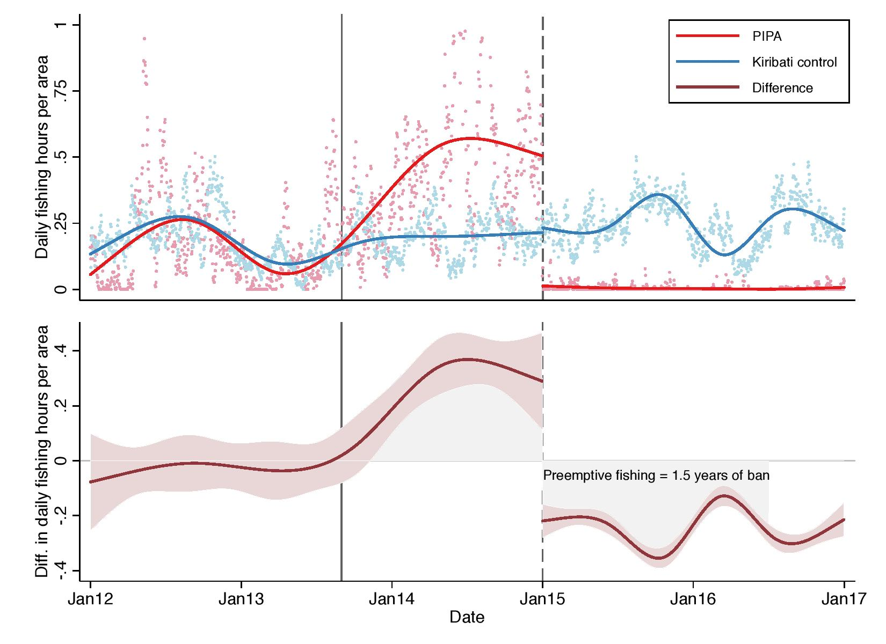

class: inverse, middle

```{r, SETUP, include = F}
options(htmltools.dir.version = FALSE)

knitr::opts_chunk$set(
  fig.align = "center",
  fig.height = 7,
  fig.width = 10.5,
  cache = FALSE,
  echo = TRUE,
  message = FALSE, 
  warning = FALSE,
  hiline = TRUE
)
library(pacman)
p_load(xaringan,ggthemes, viridis, knitr, dslabs, gapminder, extrafont, Ecdat, wooldridge, tidyverse, magrittr,svglite,renderthis,xaringanthemer)


style_duo_accent(
  primary_color = "#1F4257",
  secondary_color = "#F97B64",
  inverse_header_color = "#FFFFFF"
)
# Notes directory
dir_slides <- "/Users/tami/Dropbox (University of Oregon)/EC320--Ren--2022/EC320/Lectures/01-Introduction"
# Knitr options


to_pdf("01-Introduction.RMD")


#opts_chunk$set(dev = "svg")
#options(device = function(file, width, height) {
#  svg(tempfile(), width = width, height = height)
#})
#options(crayon.enabled = F)
#options(knitr.table.format = "html")

```


# Prologue

---
# Who am I? 

[**Tamara Ren**](https://tamara-ren.com) (or Tami)

- Doctoral student in economics

- Applied micro and econometrics 

- I study the economics of education and labor. Currently developing a methods paper to use panel Google Trends data 

--

# Where can you find me?

- Office: Zoom 
- Office hours: Monday and Wednesday 2:00-3:00 PM, Friday 10:00-12:00 PM, or by appointment
- Email: [.mono[tren@uoregon.edu]](mailto:tren@uoregon.edu) **(use EC 320 in the subject line)**

---
# How will we interact? 

- We are all on Zoom, so please be courteous to everyone 
  - Mute your microphone if you are not speaking
  - Be professional when your camera is on 

- Use your hand option or type in chat if you have a question. You can unmute yourself to ask your question  

- Cameras are not required to be on---however, it does help improve the classroom environment. I highly encourage you keep your cameras on.

- I will post recordings on Canvas 

---
# Course Material

Required:
- R and RStudio (Both are free)
- You will need access to a computer

Recommended: 
- Introduction to Econometrics, 5th Ed. by C. Dougherty (or older editions)

---
# Grade Distribution  

- 30% Homework 
- 35% Midterm
- 35% Final 

Your grade is a **merit** based grade --- there are no other ways to earn a higher grade besides your work. I do not give extra points for attendance or for asking questions. Your grade is how well you complete your assignments. 

---
# Grading Policy 

Your final score will be curved. I follow the department's [grading policy](https://economics.uoregon.edu/undergraduate-studies/department-grading-standards/)  

>"In particular, the department’s general rule for percent A’s and B’s (excluding grades of P, NP, I, X, Y, and W) for undergraduate courses will be 55% for lower-division courses (i.e., EC 101, 201, and 202), and 65% for 300-level and 400-level upper-division courses"
    
- What this means is that I will have a general idea of how you are doing in the class, but I will not know your final score **UNTIL** the final. I will do my best to answer your questions, but please do not demand definitive answers. 


---
# Important Dates


- Homework 1 due Saturday, June 25 
- Homework 2 due Saturday, July 2 
- Midterm: Thursday, June 30
- Homework due Saturday, July 9 
- Homework due Thursday, July 14
- *Final Friday July 15, 12:00* 


Homework and tests will be available on __Canvas__. You must submit your finished work on Canvas. 

Class material will be available on GitHub and Canvas. Any handwritten notes or examples will be posted on Canvas. 

---
# Labs 

Learning R 

Develop practical skills based on the material we cover 

Lab sessions will be held on Mondays during lecture time from 1-1:50 (except for the first lab). I will cover material that you will need to complete your homework.


---
class: inverse, middle

# Motivation

---
# Why study econometrics? 

--

1. Develop __skills that employers value__.

--

1. Cultivate __healthy skepticism__.

--

1. Learn about the world using __data__.

???

Government agencies and private firms rely on data to make informed decisions. Requires people who can clean and analyze data, create informative visualizations, and communicate results. .mono[R] facilitates these tasks.

When should we trust the findings of a study? Junk science abounds. Blind faith in science and science denialism are harmful. Econometrics gives us a way to evaluate the quality of evidence. Makes us better citizens.

Historically, high quality data were scarce. Econometricians had to think rigorously and creatively about how to learn from less than ideal data. Result: proliferation of robust methods with falsifiable assumptions.

---
# Why study econometrics?

## Provide answers to important questions

--

- Do minimum wage policies __reduce poverty__?

--

- Does the death penalty __deter violent crime__?

--

- Are recessions __good for your health__?

--

- How will global warming __affect the economy__?

--

- What __explains the gender pay gap__?
---
- Many, many, many more! 


---
# Econometrics

Most econometric inquiry concerns one of two distinct goals:

1. .hi-red[Prediction:] Accurately .red[predict] or .purple[forecast] an outcome given a set of predictors. .red[Given what we know about] $\color{#6A5ACD}{x}$.red[, what values do we expect] $\color{#6A5ACD}{y}$ .purple[to take?]

1. .hi-green[Causal identification:] .green[Estimate] the effect of an intervention on an outcome. .green[How does] $\color{#007935}{y}$ .green[change when we change] $\color{#007935}{x}$.green[?]

???

__Prediction examples__
Netflix uses information on users and their choices to provide individualized movie recommendations.
Some states use data on defendants to predict pretrial flight risk.
The Federal Reserve uses economic data to forecast inflation, unemployment, and GDP.

__Causal examples__
Pharmaceutical companies run clinical trials to determine whether new medicines reduce symptoms or cause side effects.
Tech companies use __A/B testing__ to improve user experience (and increase profit).
Economists use __natural experiments__ to better understand how people respond to incentives.

--

The main focus of EC 320 and EC 421 is causal identification.

--

- But...both rely on a common set of statistical techniques.

--

- For those interested, Professor Tim Duy teaches forecasting (EC 422) this Winter.

---
# Econometrics

### Not all relationships are causal

```{R, spurious, echo = F, warning=FALSE, message=FALSE,out.width = "50%"}
cheese <- c(29.8,30.1,30.5,30.6,31.3,31.7,32.6,33.1,32.7,32.8)
bed_ded <- c(327,456,509,497,596,573,661,741,809,717)
df <- data.frame(cheese=cheese, 
                 bed_ded=bed_ded)
ggplot(df, aes(cheese, bed_ded)) +
  geom_point(size = 4, color = "darkslategray") +
  geom_smooth(method = "lm", se = FALSE, color = "dark red") +
  xlab("Per Capita Cheese Consumption (lbs.)") +
  ylab("Death by bedsheet tangling") +
  theme_minimal() 

```

---
# Correlation vs. Causation

Common refrain: _"Correlation doesn't necessarily imply causation!"_

- __Q:__ Why might correlation fail to describe a causal relationship?

--

- __A:__ Omitted-variables bias, selection bias, simultaneity, reverse causality.

---
# Correlation can imply causation.

- Requires strong assumptions.

- **Real life often violates these assumptions!**

- **Solutions:** Conduct an experiment or find a natural experiment.

---
# Example: *Blue Paradox*

[Recent study](https://www.pnas.org/content/116/12/5319) by UO economist [Grant McDermott](https://grantmcdermott.com) and coauthors.

**Question:** Do commercial fishers preempt fishing bans by increasing their fishing effort before the bans go into effect?

**Motivation**

- Recent conservation efforts seek to preserve aquatic habitat and increase fish stocks.
- Policy lever: Restrict fishing activity in marine protected areas.
- Concern: Preemptive behavior could *decrease* fish stocks.

--

**Data**

- Vessel-level data on fishing effort/intensity.

---
# Example: *Blue Paradox*

**Natural Experiment**
.pull-left[
Phoenix Islands Protected Area (PIPA) 

- First mentioned on 1 September 2014; implemented 1 January 2015.
- *Treatment group:* PIPA.
- *Control group:* Outlying Kiribati islands. 
]
.pull-right[
```{R, out.width = "75%", eval=TRUE, echo=FALSE}
include_graphics("figure2.jpg")
```
]
---
# Example: *Blue Paradox*

**Natural Experiment**

Measure the causal effect of the fishing ban by comparing fishing effort in treatment and control regions, before-and-after PIPA.

- A *difference-in-differences* comparison.
- .hi[Assumption:] .pink[Parallel trends.] If we believe this assumption, then the observed change supports a causal interpretation. If not, then the change could reflect other factors and thus fail to isolate the causal effect of the ban.

---
# Example: *Blue Paradox*

**Results**

```{R, out.width = "50%", eval=TRUE, echo=FALSE}

```

---
# Example: *Blue Paradox*

**Discussion**

Results provide causal evidence that commercial fishers engage in preemptive behavior in response to conservation policy changes.

Results are *consistent* with economic theory, but *cannot prove* that the theory is correct.

- **Science cannot prove anything.**
- Science can .hi[falsify or reject] existing hypotheses or .hi[corroborate] existing evidence.

--

Also...the causal statement rests on a critical assumption.

- Cannot prove that the assumption is true, but can falsify it.
- Failure to falsify $\neq$ assumption is true.

---
class: inverse, middle
# .mono[R]

---
layout: true
# .mono[R]

---

## What is .mono[R]?

According to the [.mono[R] project website](https://www.r-project.org),

> .mono[R] is a free software environment for statistical computing and graphics. It compiles and runs on a wide variety of UNIX platforms, Windows and MacOS.

--

What does that mean?

- .mono[R] is __free__ and __open source__.

- .mono[R] executes a variety of statistical techniques and produces beautiful graphs.

- .mono[R] has a vibrant, thriving online community (see [stack overflow](https://stackoverflow.com/questions/tagged/r)).


---

## Why are we using .mono[R]?

1. .mono[R] is __free__.

--

1. __.mono[R] is popular__ among economists, political scientists, psychologists, sociologists, geographers, anthropologists, biologists, data scientists, and statisticians.

--

1. __Employers prefer .mono[R]__ over most competing software environments.

--

1. .mono[R] can __adapt to nearly any task__: 'metrics, spatial data analysis, machine learning, web scraping, data cleaning, website building, teaching.

---

```{R, statistical languages, echo = F}
# The popularity data
pop_df <- data.frame(
  lang = c("SQL", "Python", "R", "SAS", "Matlab", "SPSS", "Stata"),
  n_jobs = c(25694, 27560, 13506, 7786, 3449, 2694, 1303),
  free = c(T, T, T, F, F, F, F)
)
pop_df %<>% mutate(lang = lang %>% factor(ordered = T))
# Plot it
ggplot(data = pop_df, aes(x = lang, y = n_jobs, fill = free)) +
geom_col() +
geom_hline(yintercept = 0) +
aes(x = reorder(lang, -n_jobs), fill = reorder(free, -free)) +
xlab("Statistical language") +
scale_y_continuous(label = scales::comma) +
ylab("Number of jobs") +
ggtitle(
  "Comparing statistical languages",
  subtitle = "Number of job postings on Indeed.com, 2019/07/17"
) +
scale_fill_manual(
  "Free?",
  labels = c("True", "False"),
  values = c("dark red", "darkslategray")
) +
theme_minimal() +
theme(legend.position = "bottom")
```

